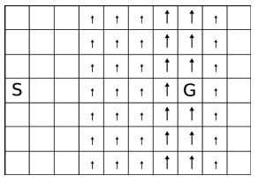

# Tabular Reinforcement Learning

# Description 
This repository contains the basic concepts of Tabular Reinforcement Learning. It considers model-based methods such as **Dynamic Programming** and model-free methods such as **Q-learning** and **SARSA**. It tackles the issue of on and off policy learning and compares them. Finally introduces a depth in the target function in order to implement **n-step Q-learning** and **Monte Carlo** methods.

# Environment
The methods are tested on the so called environment Stochastic Windy Gridworld. It is a 10x7 grid, where each cell is numbered from 0 to 70 starting from the bottom left cell and moving upwards until reaching the seventieth cell located at the bottom right. The agent moves up, down, left and right and his initial position indicated as ’S’ in the figure below is (0,3). The goal is to move the agent to the final position (7,3), indicated as ’G’. In the environment and especially in columns 3,4,5,8 there is a wind that makes the agent move one step upwards while in columns 6 and 7 the wind pushes it upwards by two steps. The fact that the presence of the
wind is random, since it blows 80% of the time makes the environment stochastic. The agent’s reward is -1 in each step and +35 if the goal is reached. Achieving the final state leads to the termination of the episode. 

<!-- 

<em> Stochastic Windy Gridworld: 10x7 grid. ’S’ is the agent’s starting point and ’G’ is the goal. The small arrows in columns 3,4,5,8 indicate that the wind moves the agent upwards by one step, whereas the big ones in columns 6,7 indicate a two step movement.</em>

 -->
<figure align="center">

<figcaption align = "center">Stochastic Windy Gridworld: 10x7 grid. ’S’ is the agent’s starting point and ’G’ is the goal. The small arrows in columns 3,4,5,8 indicate that the wind moves the agent upwards by one step, whereas the big ones in columns 6,7 indicate a two step movement.</figcaption>
</figure>
